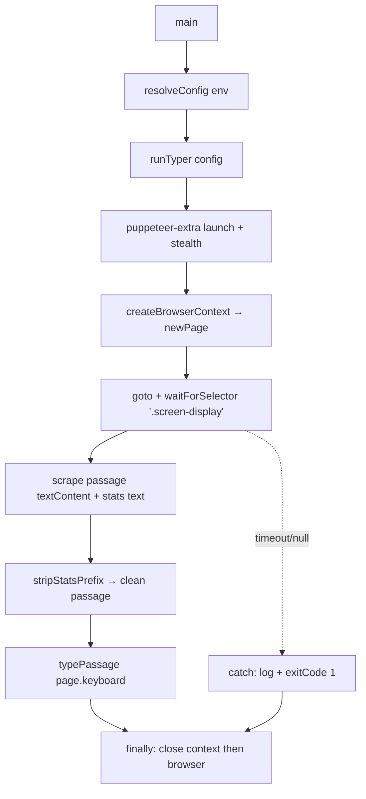

# Architecture

## System Diagram

## Component Descriptions

### Orchestrator
- **Purpose**: Owns the browser session and sequences the run: launch → isolated context → wait for readiness → scrape → type → guaranteed teardown.
- **Location**: `FlashTyper.js`
- **Key responsibilities**: Registers the stealth plugin once at module load; exposes `runTyper(config)` and a `main()` entry point; wraps the whole run in `try/catch/finally` so the browser always closes; holds the stable DOM selectors.

### Configuration
- **Purpose**: Turns environment variables into a single typed config object so behavior is changed without touching code.
- **Location**: `src/config.js`
- **Key responsibilities**: `resolveConfig(env)` resolves the target URL, Chrome executable path, headless flag, per-keystroke delay, and selector-wait timeout, applying safe defaults and numeric parsing with fallbacks.

### Scrape cleanup
- **Purpose**: Extracts the passage to type from the raw text content of the test display, which is prefixed with the live stats bar.
- **Location**: `src/text.js`
- **Key responsibilities**: `stripStatsPrefix(rawText, statsText)` removes the stats prefix — slicing an exact live-read stats string when available, or falling back to a regex that strips a leading run of stat tokens only when a numeric value is present.

### Typing loop
- **Purpose**: Replays a string as keyboard input against an injectable keyboard interface.
- **Location**: `src/typer.js`
- **Key responsibilities**: `typePassage(keyboard, text, { delayMs })` iterates by code point, presses Enter on the return marker (`⏎`) and types every other character with the configured delay.

## Data Flow

1. `main()` calls `resolveConfig(process.env)` to build the run configuration.
2. `runTyper()` launches a stealth-patched Chromium and opens a page inside a fresh, isolated browser context.
3. It navigates to the test URL and waits for the passage element (`.screen-display`) to render, rather than sleeping a fixed amount of time.
4. It reads the passage's text content and, separately, the stats bar text; `stripStatsPrefix` produces the clean passage.
5. It types one throwaway key to start the timed test, then `typePassage` replays the passage keystroke by keystroke.
6. A `finally` block closes the context and the browser on every path — success, error, or timeout.

## External Integrations

| Service | Purpose | Notes |
|---------|---------|-------|
| thetypingcat.com | The typing-speed test the tool drives | Public web page; no auth. The scrape relies on a semantic class name, not generated style hashes, to tolerate UI churn. |
| Chromium (via Puppeteer) | The browser that's automated | Bundled with Puppeteer by default; overridable with `CHROME_PATH`. Driven through `puppeteer-extra` with the stealth plugin. |

## Key Architectural Decisions

### Thin orchestrator over pure, injectable modules
- **Context**: The original implementation was a single inline async function that mixed browser control, scraping, text cleanup, and the typing loop — none of it testable without a live browser.
- **Decision**: Extract configuration, stats stripping, and the keystroke loop into pure modules, and have the typing loop accept an injected keyboard interface.
- **Rationale**: The interesting logic (prefix stripping, Enter handling, delay passthrough) is now covered by fast unit tests with a fake keyboard. The alternative — testing everything through Puppeteer — would be slow and flaky for logic that has nothing to do with a browser.

### Offline HTML fixture for the end-to-end test
- **Context**: I wanted an integration test that proves the real scrape-then-type pipeline works, but live-site tests are non-deterministic and break when the site changes or the network is slow.
- **Decision**: Ship a small local HTML fixture that mirrors the test page's structure and drive real Chromium against it over a `file://` URL.
- **Rationale**: The test exercises the genuine Puppeteer keyboard and DOM-scrape path, asserts the exact typed output (including the `⏎`→Enter newline), and runs deterministically with no network. The orchestrator's lifecycle/teardown is covered by a second test against the same fixture.

### Dynamic stats stripping instead of a hardcoded replace
- **Context**: The display text is the stats bar concatenated with the passage. The original code stripped it with a hardcoded literal of the exact stats string, which breaks the moment any score or label changes.
- **Decision**: Prefer slicing a live-read stats string; fall back to a regex that only strips a leading stat run when it contains a numeric token.
- **Rationale**: The numeric gate is the key detail — it prevents over-stripping a passage that legitimately begins with a word like "Time" or "Accuracy", while still removing the real glued stats bar.

### Stable semantic selector over generated style hashes
- **Context**: The page is built with styled-components, whose generated class names (e.g. `…hXkFOq`) change on every rebuild. The original selector chained several of those hashes.
- **Decision**: Target the human-authored `.screen-display` class.
- **Rationale**: Semantic class names are far stickier than build-generated hashes, so the scrape survives routine site rebuilds.

### Guaranteed teardown in an isolated context
- **Context**: The original run had no error handling and never closed the browser, leaking a headful Chromium process on every failure.
- **Decision**: Open the page from a fresh `createBrowserContext()` and close both context and browser in a `finally` block; signal failure via `process.exitCode`.
- **Rationale**: No orphaned processes on any path, and each run gets a clean, cookieless session. The isolated context makes the intent explicit instead of silently using the default one.
